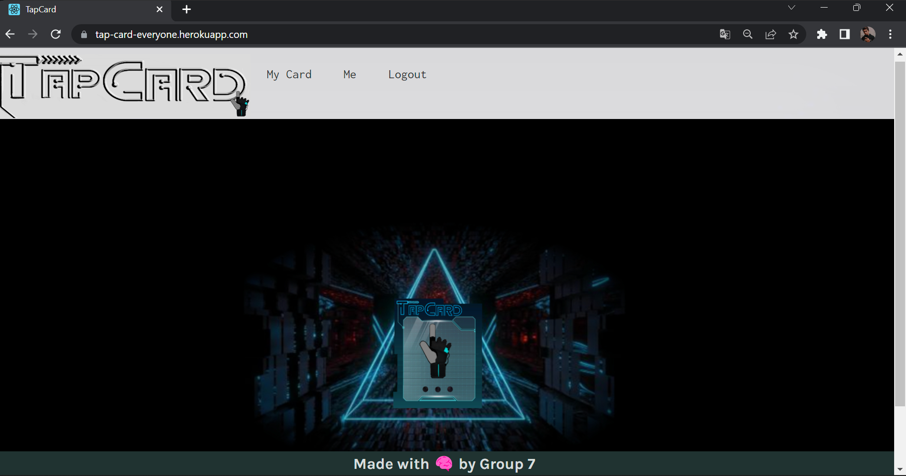

# Tap Card

## Table of Contents

- [Finished Work](#💡💡💡finished-work)
- [Description](#description)
- [User Story](#user-story)
- [Installation](#installation)
- [Usage](#usage)
- [License](#license)
- [Contributing](#contributing)
- [Technologies](#technologies)

## 💡💡💡Finished work

- [The Link of the deployed application.](https://tap-card-everyone.herokuapp.com/home)

- [The Link of the GitHub repository.](https://github.com/Israel2800/MERN-Project-3)

## Description

"Tap Card" offers students and alumni the ability to connect with one another in a secure environment to share their interests and wealth of knowledge as they plan for future careers.

It is a MERN stack single-page application that can works with real-world data to solve a real-world challenge.

## User Story

    WHEN users visit the home page, THEN they are presented with cards.
    WHEN users interact with the Login tab, THEN they are presented with a Login form requesting their email and password.
    WHEN users interact with the Signup tab, THEN they are presented with a form requesting them to enter a username, email address, and password.
    WHEN users click the Submit button on the Login page, THEN they are presented with a page that allows them to enter their information.
    WHEN users interact with the My Card tab, THEN they are presented with their profile.

## Installation

The user should clone the repository from GitHub and download Node.

`git clone` `npm i`  `npm run seed` `npm run develop`

## Usage

- Clone this repository to use this application on local machine:

`git clone`

- To install necessary dependencies, run the following command :

`npm i`

- The application will be invoked with the following command: This will start localhost server on PORT 3001.

`npm run seed` `npm run develop`

## License

This application is covered by the MIT license.

## Contributing

- Israel Aguilar

- Shuai Zuo

- Dac Broussard

- Jessica Hoffman

## Technologies

- HTML

- React

- CSS

- Javascript

- Apollo

- Node

- Express

- Bcrypt

- GraphQI

- Mongoose

